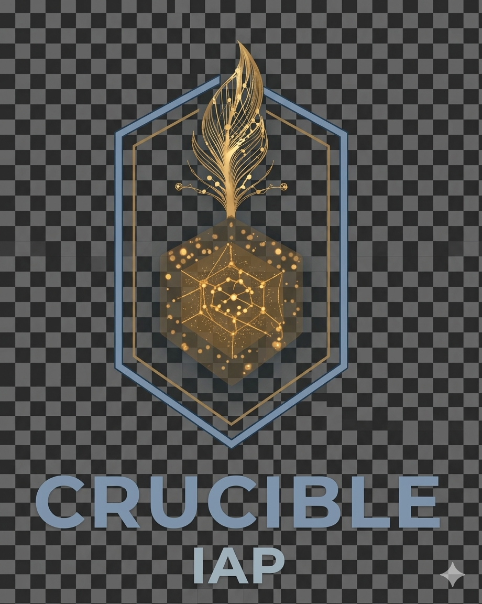

# Crucible IAP



**Infrastructure Automation Platform** — a self-hosted, privacy-first alternative to Spacelift.

[](https://github.com/ponack/crucible-iap/actions/workflows/ci.yml)


---

Crucible IAP orchestrates OpenTofu, Terraform, Ansible, and Pulumi runs with policy enforcement, built-in state storage, drift detection, and a full audit trail — all running in your own infrastructure with no SaaS dependency.

## Features

- **GitOps-driven** — push to git, runs trigger automatically
- **Policy-as-code** — OPA/Rego for plan validation, approval gates, trigger chains
- **Built-in state backend** — Terraform/OpenTofu HTTP backend compatible; no S3 required
- **Ephemeral job runners** — each run in an isolated, read-only Docker container
- **SSO via OIDC** — Authentik, Okta, GitHub, Keycloak, or any OIDC-compatible provider
- **Drift detection** — scheduled proposed runs with optional auto-remediation
- **Full audit log** — every action recorded; append-only, tamper-resistant
- **Flexible deployment** — bundled Caddy for zero-config TLS, or bring your own reverse proxy

## Quick start

```bash
cp .env.example .env
# Edit .env — set CRUCIBLE_BASE_URL, CRUCIBLE_SECRET_KEY, POSTGRES_PASSWORD, etc.
docker compose -f deploy/docker-compose.yml up -d
```

Crucible IAP will be available at `https://localhost`. Caddy provisions a TLS certificate automatically (set `CADDY_ACME_EMAIL` for Let's Encrypt).

## Deployment options

### Bundled Caddy (default)

Zero-config TLS via Let's Encrypt or self-signed. Everything in one `docker compose up`.

```bash
docker compose -f deploy/docker-compose.yml up -d
```

### External reverse proxy

Use your existing nginx, Traefik, or Caddy instance instead.

```bash
docker compose -f deploy/docker-compose.yml --profile external-proxy up -d
```

The API binds to `127.0.0.1:8080` and the UI to `127.0.0.1:3000` by default. Point your proxy at those addresses. Ready-to-use config examples are in [`deploy/proxy-examples/`](deploy/proxy-examples/):

| File | Proxy |
| ---- | ----- |
| [`nginx.conf`](deploy/proxy-examples/nginx.conf) | nginx |
| [`traefik.yml`](deploy/proxy-examples/traefik.yml) | Traefik v3 |
| [`caddy-standalone.Caddyfile`](deploy/proxy-examples/caddy-standalone.Caddyfile) | Caddy (external) |

### Bundled Authentik IdP (optional)

Add `--profile authentik` to include a self-hosted Authentik instance. Skip this if you already have an IdP.

```bash
# Default Caddy + Authentik
docker compose -f deploy/docker-compose.yml --profile authentik up -d

# External proxy + Authentik
docker compose -f deploy/docker-compose.yml --profile external-proxy --profile authentik up -d
```

## Architecture

```text
Browser / CI
    │
    ▼
Reverse proxy (Caddy bundled, or nginx / Traefik / your own)
    │
    ├── /auth, /api, /health  →  Crucible API (Go + Echo)
    │                                │
    │                     ┌──────────┼──────────────┐
    │                     ▼          ▼              ▼
    │               PostgreSQL     MinIO       OPA engine
    │               (DB + queue    (state,     (embedded,
    │                + audit log)   plans,      Rego)
    │                               logs)
    │                     │
    │              River job queue
    │                     │
    │           Worker dispatcher (Go)
    │                     │
    │           Docker SDK → ephemeral runner container
    │                        (tofu / terraform / ansible / pulumi)
    │
    └── /*  →  Crucible UI (SvelteKit SSR)
```

See [docs/architecture.md](docs/architecture.md) for the full design including security model, state backend protocol, and policy evaluation hooks.

## Development

Requirements: Go 1.23+, Node.js 22+, pnpm, Docker

```bash
# Start dependencies (PostgreSQL + MinIO only)
docker compose -f deploy/docker-compose.dev.yml up -d

# Run API (auto-migrates on first start)
cd api && go mod tidy && go run ./cmd/crucible-iap

# Run UI
cd ui && pnpm install && pnpm dev
```

The UI dev server proxies `/api` and `/auth` to the API at `localhost:8080` automatically.

## State backend configuration

Point any OpenTofu or Terraform stack at Crucible's built-in state backend:

```hcl
terraform {
  backend "http" {
    address        = "https://crucible.example.com/api/v1/state/<stack-id>"
    lock_address   = "https://crucible.example.com/api/v1/state/<stack-id>"
    unlock_address = "https://crucible.example.com/api/v1/state/<stack-id>"
    username       = "<stack-token-id>"
    password       = "<stack-token-secret>"
  }
}
```

State is stored encrypted in MinIO with full version history.

## License

[AGPL-3.0-or-later](LICENSE) — free to self-host forever. Commercial licenses available for proprietary or SaaS use.
